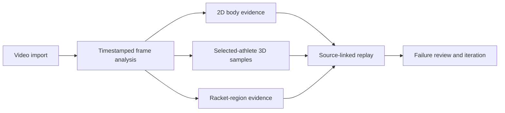

[English](README.md) · [简体中文](README.zh-CN.md)

# Motus

### See your movement, not just your video.

An evidence-first badminton motion laboratory for synchronized 2D analysis, selected-athlete 3D replay and racket-direction research.

`SwiftUI` · `Apple Vision` · `AVFoundation` · `SceneKit` · `Core ML research`

## Why I built it

Most video-analysis products can generate a confident-looking result. The harder problem is deciding whether that result is tied to the correct athlete, the correct frame and enough visual evidence to support the claim.

Motus is my attempt to make that chain inspectable. A result can be traced back to source time; gaps stay visible in the underlying record; display reconstruction is labelled separately from native measurements; and failed racket candidates remain available for debugging.

## Current prototype

| Surface | What it does | Evidence boundary |
|---|---|---|
| Source replay | Imports a real video and keeps overlays synchronized to decoded timestamps | The video remains the reference surface |
| 2D motion | Presents pose evidence and derived joint geometry | Depends on visible, finite source joints |
| Selected-athlete 3D | Replays native 3D samples and bounded display reconstruction | Display continuity is not counted as new recognition |
| Racket direction | Uses verified visual regions first, then a wrist/forearm direction aid | The wrist-based aid is a presentation, not a detected racket head |
| Evidence navigation | Returns a result to its source moment and preserves rejection history | No detached score is treated as proof |

## System shape

The public diagram intentionally stops at the product boundary. Candidate-selection rules, thresholds, model files, raw archives and production source remain in a private repository.

## Technical approach

### Source time is the common reference

The video is the reference for the analysis, rather than a decorative background. A body result, racket region or 3D sample needs a source frame or timestamp so that the interface can return to the moment that produced it. This is what makes synchronization useful for review: the question is not merely whether several views move together, but whether they show evidence from the same source moment and athlete.

AVFoundation provides the video-replay surface; Apple Vision supplies body-analysis evidence; SceneKit presents the spatial view. The product connects these surfaces through source-linked replay. This public description covers their roles without exposing private selection rules or model configuration.

### Observation and presentation serve different purposes

| Layer | What it represents | What it must not imply |
|---|---|---|
| Native observation | Body or spatial samples produced from the source analysis | That an unobserved moment was measured |
| Derived geometry | Joint relationships or direction aids computed from available evidence | That every derived value is an independent visual detection |
| Display reconstruction | A bounded presentation used to improve replay continuity | That filling a display interval increases recognition count or accuracy |

This distinction allows replay quality and measurement quality to be examined separately. A smoother 3D view can make movement easier to inspect, while the underlying record still exposes where native samples exist and where presentation reconstruction was used. The methodology treats source identity, continuity and measurement provenance as separate review questions.

### A wrist-direction aid is not a racket-head observation

The wrist and forearm can supply useful direction geometry when the racket is difficult to see, but that geometry does not itself locate the racket head or establish racket-face orientation. Motus therefore distinguishes verified visual-region evidence from a wrist-based presentation aid.

An important failure case involved a plausible-looking region near a face and hand. The retained iteration record shows why a region's score is not enough: a grip-proximal region may remain useful as tracking evidence without supporting a racket-head direction. Rejected 2D anchors must also stay out of the 3D racket presentation. The public [failure note](research/failure-driven-iteration.md) documents that boundary without publishing internal thresholds.

## Engineering evidence

These numbers describe reproducible engineering checks. They are not model-accuracy percentages.

| Verified item | Latest recorded result |
|---|---:|
| Deterministic and isolated checks | 3,838 passed |
| Test suites | 38 passed |
| Fixed 5-second serve display grid | 295 / 301 body ticks |
| Fixed 5-second lunge display grid | 231 / 301 body ticks |
| Evidence records copied and hash-verified | 9,211 / 9,211 |
| Build configurations | iOS simulator, iOS arm64, Mac Catalyst, isolated UI build |

The 9,211 records include source snapshots, logs and failures. They are an engineering archive, not 9,211 training samples. Physical iPhone performance and general badminton accuracy still require separate validation.

### Reading the evaluation correctly

- **Engineering checks** exercise properties of the implementation. The documented checks include damaged timestamps, person changes, low-confidence joints, discontinuities, stale callbacks and invalid source bindings. Passing them does not establish performance on every unseen video.
- **Display-grid coverage** counts the fixed evaluation positions with body display in each selected five-second clip. The 295 / 301 and 231 / 301 results describe those clips and that display grid; they are not counts of independently recognized poses and do not measure correctness against independently labelled ground truth.
- **Archive verification** confirms that the retained records were copied with matching hashes. It supports preservation and traceability, not recognition accuracy.
- **Build checks** establish that the recorded configurations build. They do not replace a physical-device performance study or a user evaluation.

The open research questions include fast rotation and motion blur, partial racket visibility, athlete overlap, background rails, physical validation of racket-face orientation, and evaluation on a larger independently labelled set. These remain separate from the engineering results above.

## Failure-driven iteration

One early racket candidate attached to a face/hand region. I kept the bad output, added a rejection boundary, then verified that the rejected anchor no longer contaminated the 3D view.

<table>
  <tr>
    <td width="33%"> <b>1 · Observe</b> Incorrect visual anchor retained.</td>
    <td width="33%"> <b>2 · Reject</b> Source moment remains reviewable.</td>
    <td width="33%"> <b>3 · Verify</b> The invalid reference no longer appears in 3D.</td>
  </tr>
</table>

The useful outcome is specific: the wrong source anchor is retained for review, rejected for the unsupported role, and prevented from contaminating the spatial presentation. Keeping the before-and-after evidence makes this change inspectable and provides a concrete regression case for later revisions.

Read the short notes on [methodology](research/methodology.md) and [failure-driven iteration](research/failure-driven-iteration.md).

## My contribution

I defined the product direction, research questions, user experience, evidence boundaries and acceptance checks; selected and reviewed test moments; investigated failures; and decided what the product may claim. AI tools assisted implementation, code review and debugging. Public results are included only after I checked the corresponding builds, tests or source evidence.

## Repository scope

This is a public case-study repository. It contains selected screenshots, high-level methodology and verified claims. It does not contain the private Motus source tree, models, raw videos, internal thresholds, commercial plans or complete development archive.

## Attribution

The badminton footage visible in selected screenshots is credited to **Badminton klub Ljubljana** and distributed under **CC BY 3.0**. The source was cropped, scaled, muted and overlaid with Motus analysis. Full details are in [ATTRIBUTIONS.md](ATTRIBUTIONS.md).

## Rights

Original Motus writing, interface design and case-study material © 2026 David Deng. See [RIGHTS.md](RIGHTS.md) before reusing any material.
