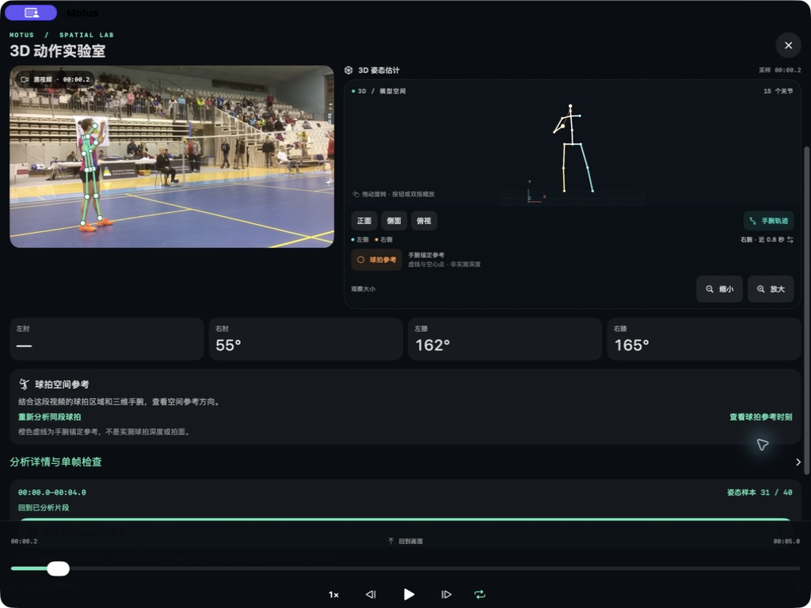
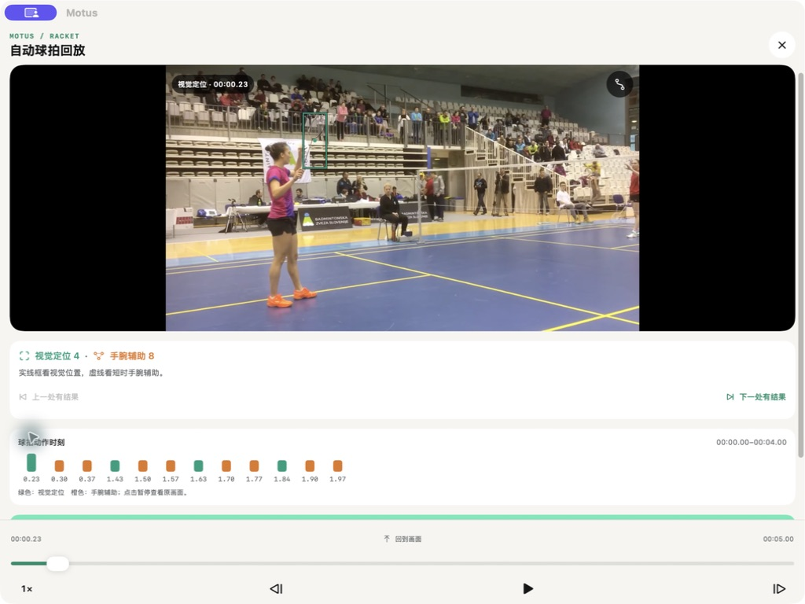
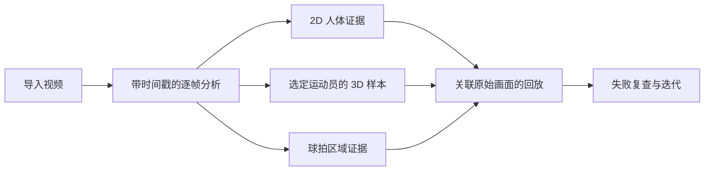
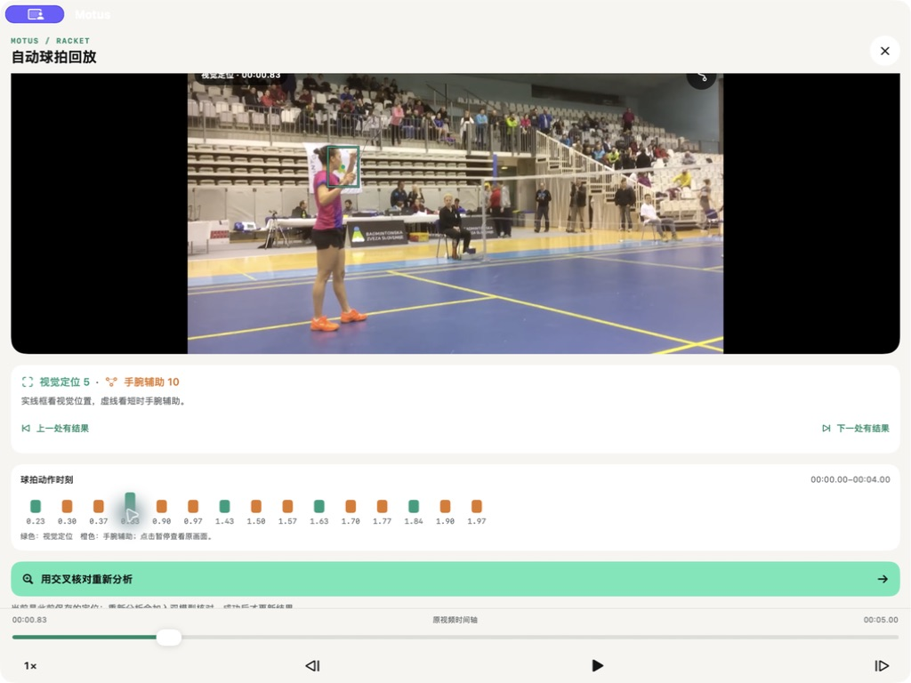
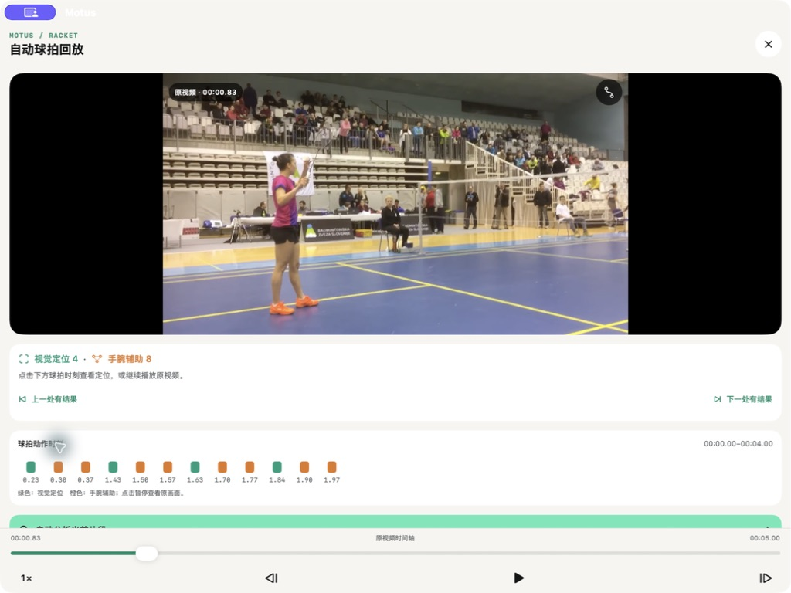
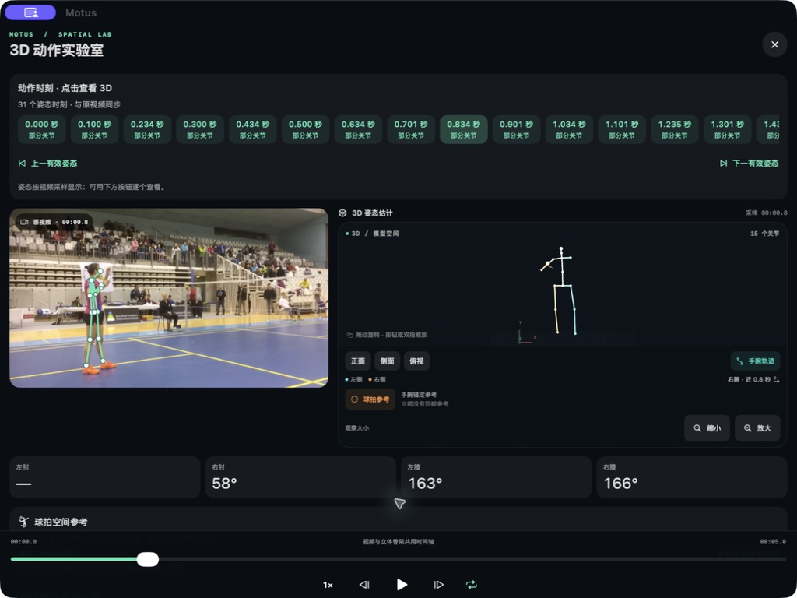

[English](README.md) · [简体中文](README.zh-CN.md)

# Motus

### 看懂动作，让视频成为可以复查的训练记录。

一个以证据为基础的羽毛球动作研究原型，探索同步 2D 分析、选定运动员的 3D 回放与球拍方向分析。

`SwiftUI` · `Apple Vision` · `AVFoundation` · `SceneKit` · `Core ML 研究`

## 为什么做这个项目

视频分析产品可以生成看起来很有把握的结果。更难的问题是：这个结果是否对应了正确的运动员、正确的画面时刻，以及足以支持结论的视觉证据？

Motus 尝试让这条证据链能够被检查。分析结果可以追溯到原始视频时间；底层记录保留数据缺口；用于显示的重建与原生测量分开标注；错误的球拍候选结果也会留档，供后续调试。

## 当前原型

| 模块 | 当前行为 | 证据边界 |
|---|---|---|
| 原始视频回放 | 导入真实视频，依据解码时间戳同步叠加层 | 原始视频始终是复查依据 |
| 2D 动作分析 | 显示姿态证据与由关节推导的几何关系 | 依赖画面中可见且数值有效的原始关节点 |
| 选定运动员的 3D 回放 | 回放原生 3D 样本，并在限定范围内重建显示 | 连续显示不计为新增识别结果 |
| 球拍方向 | 优先使用经验证的视觉区域，再提供基于手腕与前臂的方向辅助 | 手腕推算用于辅助呈现，不代表检测到了拍头 |
| 证据导航 | 将结果定位回原始时刻，并保留拒绝记录 | 脱离原始证据的分数不能独立证明结论 |

## 系统结构

公开图示仅介绍产品层面的结构。候选筛选规则、阈值、模型文件、原始档案与生产源码保存在私有仓库中。

## 技术思路

### 以原始视频时间作为共同参照

原始视频是分析的依据。人体结果、球拍区域与 3D 样本都需要保留对应的画面或时间戳，界面才能回到产生结果的那个时刻。同步回放的意义也由此变得具体：除了多个视图同时运动，还要确认它们展示的是同一原始时刻、同一运动员的证据。

AVFoundation 负责视频回放，Apple Vision 提供人体分析证据，SceneKit 呈现空间视图。产品通过关联原始时间的回放将这些视图连接起来。这里公开的是各部分的职责，不涉及私有筛选规则与模型配置。

### 将观测、推导与显示重建分开

| 层次 | 表达的内容 | 不能据此推断的结论 |
|---|---|---|
| 原生观测 | 原始分析产生的人体或空间样本 | 没有观测到的时刻也完成了测量 |
| 推导几何 | 由已有证据计算的关节关系或方向辅助 | 每个推导值都来自一次独立视觉检测 |
| 显示重建 | 在限定范围内改善回放连续性的呈现 | 补齐显示区间就增加了识别次数或准确率 |

这种区分使回放质量与测量质量能够分别检查。更平滑的 3D 视图有助于观察动作，底层记录仍需说明哪些时刻有原生样本、哪些部分使用了显示重建。研究方法因此分别检查来源身份、连续性与测量来源，避免让一个顺畅的动画代替证据。

### 手腕方向辅助与拍头观测的边界

球拍不易看清时，手腕与前臂可以提供有用的方向几何信息。但这种几何关系本身不能确定拍头的位置，也不能证明拍面的朝向。因此，Motus 区分经过验证的球拍视觉区域与基于手腕的辅助呈现。

一个典型失败案例，是在面部与手部附近出现了看起来合理的候选区域。留存记录说明，仅凭区域分数不足以确认它代表拍头：握柄附近的区域可以作为跟踪线索，但不应自动成为拍头方向证据。被拒绝的 2D 锚点也不能继续进入 3D 球拍呈现。[失败分析记录](research/failure-driven-iteration.md)公开了这一判断边界，不涉及内部阈值。

## 工程验证

以下数字描述可复现的工程检查，不是模型识别准确率。

| 验证项目 | 最近一次记录的结果 |
|---|---:|
| 确定性及隔离检查 | 3,838 项通过 |
| 测试套件 | 38 组通过 |
| 固定 5 秒发球片段的显示时间网格 | 295 / 301 个时间点有人体显示 |
| 固定 5 秒跨步片段的显示时间网格 | 231 / 301 个时间点有人体显示 |
| 完成复制并通过哈希校验的证据记录 | 9,211 / 9,211 |
| 构建配置 | iOS 模拟器、iOS arm64、Mac Catalyst、独立 UI 构建 |

这 9,211 条记录包含原始快照、日志与失败案例，属于工程档案，不等于 9,211 个训练样本。iPhone 真机性能与对一般羽毛球视频的分析准确性，仍需单独验证。

### 如何解读这些结果

- **工程检查**验证实现的性质。已记录的检查包括损坏的时间戳、运动员切换、低置信度关节、轨迹不连续、过期回调与无效来源绑定。检查通过，不代表对所有未见视频都能正确分析。
- **显示时间网格覆盖**统计选定 5 秒片段中，有人体显示的固定评估位置。295 / 301 和 231 / 301 描述的是这两个片段及其显示网格，不是独立识别的姿态数量，也不是与独立人工标注对照得出的正确率。
- **档案校验**确认已保留记录在复制后具有一致的哈希值，支持证据保存与追溯，不衡量识别准确性。
- **构建检查**证明已记录配置能够完成构建，不能代替真机性能测试或用户体验评估。

后续仍需研究快速旋转与运动模糊、球拍部分可见、运动员重叠、背景栏杆干扰，以及拍面朝向的物理验证。扩大独立标注的评估集也是单独的工作，不应由上述工程结果代替。

## 从失败中迭代

早期的一个球拍候选区域错误地附着在运动员的面部与手部附近。我保留了错误输出，补充拒绝条件，再验证被拒绝的锚点不会继续影响 3D 视图。

<table>
  <tr>
    <td width="33%"> <b>1 · 观察</b> 保留错误的视觉锚点结果。</td>
    <td width="33%"> <b>2 · 拒绝</b> 仍可回到原始时刻复查。</td>
    <td width="33%"> <b>3 · 验证</b> 无效参考不再出现在 3D 视图中。</td>
  </tr>
</table>

这次迭代的结果有明确范围：错误来源锚点被保留供复查，不再承担缺乏证据支持的角色，也不会继续影响空间呈现。前后对照的证据让修改能够被检查，并为后续版本提供具体的回归案例。

进一步阅读：[研究方法](research/methodology.md)与[失败驱动的迭代记录](research/failure-driven-iteration.md)（英文）。

## 我的贡献

我定义了产品方向、研究问题、用户体验、证据边界与验收检查；选择并审阅测试时刻；调查失败原因；决定产品能够对外作出哪些主张。AI 工具参与实现、代码审阅与调试。公开结果均在我检查对应的构建、测试或原始证据之后纳入。

## 仓库范围

这是一个公开项目案例仓库，包含经过选择的截图、概括性的研究方法与经过验证的主张。不包含 Motus 私有源码、模型、原始视频、内部阈值、商业计划或完整开发档案。

## 素材署名

部分截图中的羽毛球视频由 **Badminton klub Ljubljana** 提供，采用 **CC BY 3.0** 许可。原始素材经过裁剪、缩放、静音处理，并叠加 Motus 分析画面。完整来源与许可说明见 [ATTRIBUTIONS.md](ATTRIBUTIONS.md)。

## 权利说明

Motus 原创文字、界面设计与案例材料 © 2026 David Deng。使用任何材料前，请查阅 [RIGHTS.md](RIGHTS.md)。
